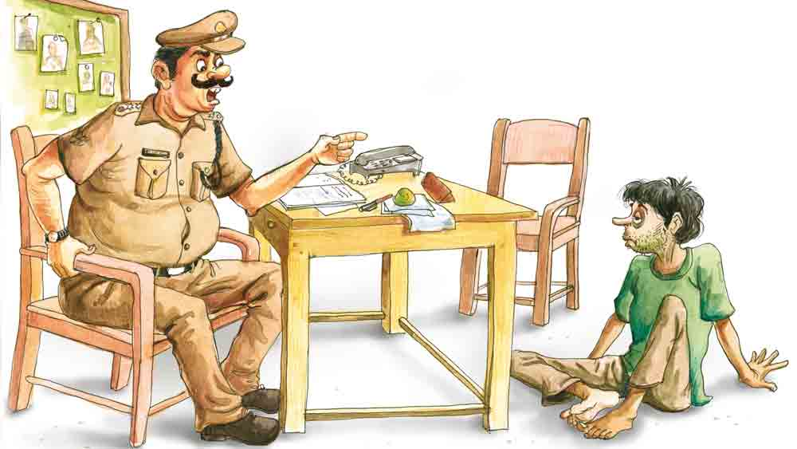

 

<h1 align=center> হাঁচি</h1>
<h2 align=center></h2>
দারোগাবাবু বললেন, ‌“ছিলি তো ব্যাটা পাক্কা পকেটমার। তা গাঁট কাটা ছেড়ে হঠাৎ চোর-চোট্টা হওয়ার সাধ জাগল কেন রে! কমলা বুদ্ধি দিয়েছে?”   পটাই বলল, ‌“না দারগাবাবু, সে বিটির কুনো দোষ নাই। সে ত  অকাজ-কুকাজ ছেড়ি দিতি বলে। সকাল-সন্দা উঠতি বসতি গাল পাড়ে।”   “বটে!”   পটাই বলল, “কমলিটা বড় বুঝদার মেয়ে। আমারে খুব চোখে চোখে রাখে। সে বিটি কয়, পাগলেও নাকি নিজের ভাল-মন্দ বোঝে। বৌটার কথা এবার মানি চলতি হবে।”   “সে তো বেশ সুখের কথা।”   দারোগাবাবু এবার জিজ্ঞেস করলেন, ‌“কমলার কথা এখন থাক। যা জানতে চাইছি, সোজাসুজি উত্তর দে। চুরি-চামারি আবার কবে থেকে শুরু করলি?”   “কী বলব হুজুর!” মাথা চুলকে পটাই বলে, ‌“দিনকাল বেজায় খারাপ। দিন কতক ধরি যা চলছে— পকেট ফরসা। পথে-ঘাটে জনমনিষ্যি নাই, চারধার শুনশান, টেরেন-বাস উধাও। এমুনটা হলি প্যাট চলে?”   “বুঝলাম।”   “এজ্ঞে, হিসেবডা তবে গে 
কী দাঁড়াল?”   “মানে?”   “চুরি-ছেনতাই ছেড়ে ঘরে বসি থাকব? প্যাটে কিল মেরে উপাস দে মরব? সেইটে কুনো নেয্য কথা হল?”   দারোগাবাবু বললেন, ‌“তা বলে লোকের পকেট কাটবি?”   একটু ভেবে-টেবে পটাই বলল, ‌“চুরি-ছেনতাই পকেট কাটা, এ হল গে আমাদের তিন পুরুষের কারবার। বরাবর ভেবি আসতিছি, কাজ কারবার কি উঠায়ে দেব? বাপঠাকুদ্দার মুখি চুন কালি লেপি দেব?” তার পর একটু ঝুঁকে বসে পটাই বলল, ‌“তবে আপনেরে আমি মিছা কথা কইব না, হুজুর। বিস্তর ভেবি-টেবি দ্যাখলাম, এবার এ সকল কাজ ছেড়িই দিতি হবে। চুরি ছেনতাইয়ের কাজে মেলা ঝামেলা। কমলির কথাটাই ঠিক। ঘরে বসি বিড়ি বাঁধব, ঠোঙা বানাব— রানি-টুনির প্যাট ঠিক চলি যাবে।”   “হারামজাদা, যেন জ্ঞান-পাপী!”   “বিষয়টা জ্ঞান-গম্যির কথা নয়, হুজুর। ছোটোমোটো ভাবনার কথা। বাঘা বাঘা ঠগবাজ আর গাঁটকাটারা যদি এমুন ভাবে ভাবতি পারে, তবে তো বেঁচি থাকাটা বেশ সুখের হয়, না কী বলেন!”   “বটে!”   নাকটা একটু টেনে পটাই বলল, ‌“তবে মানুষটা আমি বড় খারাপ নই। হলপ করি বলতি পারি, মদ গ্যাঁজা ভাঙ— কুনো কালে চাখি দেখি নাই। এর তার বেপদে-আপদে ঝাপায়ে পড়ি। এট্টু বেশি কথা কই ঠিকই, তবে আগাপাশতলা ডাহা মুখ্যুও নই। সাত কেলাস তক পাশও দেছি।”   “আচ্ছা!”   “কিন্তুক কথাটা হচ্ছে গে হুজুর, প্যাটের দায় বড় দায়। আমি কী আর সাধ করি গাঁট কাটি? নিজের জন্যি ভাবি নে, বৌটারে ভাত কাপড়ে রাখতি হবে তো!”   “ব্যাটা ধম্মোপুত্তুর...” একটু থেমে দারোগাবাবু বললেন, ‌“জ্ঞান-গম্যির কথা তো অনেক হল, আসল কথাটা এড়িয়ে গেলি। জ্ঞানের কথা না বলে এবার একটু মেন লাইনে আয়।”   “এজ্ঞে, কয়েন হুজুর।”   ‌“তোর কাছে ঠিক যেমন জানতে চাইব, সরাসরি তার জবাব দিবি। ‌মিত্তিরবাড়িতে কি তুই একাই ঢুকেছিলি‌?”   ‌“এজ্ঞে, আমি একাই ছ্যালম।”   “সত্যি বলছিস?”   ‌“পটাই কক্ষুনো মিছে কথা কয় না। কমলির কিরে।”   ‌“কিন্তু সদর দরজার তালা না ভেঙে ভিতরে ঢুকলি কী করে?”   “পাঁচিল টপকায়ে কার্নিশ বে ছাদের চিলিকোঠায় সেঁধুয়ে গেলাম।”   দারোগাবাবু বললেন, “কিন্তু মাঝরাত্তিরে হঠাৎ চুরি করতে গিয়ে ধরা পড়লি, ফের ছাড়াও পেয়ে গেলি— এটা তো আমার মাথায় ঢুকছে না।”   “সে-একখান বেত্তান্ত বটে, অনাচ্ছিষ্টি কাণ্ডও বলতি পারেন।”   একটু থেমে পটাই বলল, ‌“মিত্তির বাড়ির চিলিকোঠা ঘরে যেই ঘাপটি মেরে বসিছি, ঠিক তখুনি অনাচ্ছিষ্টি কাণ্ড ঘটি গেল। সব কেমুন লটখট হয়ে গেল।”   ‌“হুম, কেসটা কী?”   ‌“কিসে য্যানো এক বেমক্কা ধাক্কা লেগি গেল এমুন যে, আওয়াজ শুনি বাড়ির সকলে জেগি উঠল।”   ‌“হুম! তার পর?”   ‌“পয়লা চোটে মাকড়াগুলান খুব হম্বিতম্বি করল। নরম হাতের কিল চড় ঢুঁসো ঝরি পড়তি লাগল। শেষটা আমার হাত-পা বেঁধি ফেলি রাখল। তাপ্পর সে এক কঠিন কাণ্ড!”   ‌“হলটা কী?”   ‌“শেষ রেতে আর একখান নাটক। হুট করি য্যানো ভোজবাজি ঘটি গেল। আমার নাকের গত্তে এমুন ছুলবুলানি হতি লাগল যে কী বলব! হাঁচির চোটে পেরান যায় আর কী। শালো, মরণের হাঁচি থামতিই চায় না!”   ‌“তার পর?”   ‌“হাচির ভাঁজে ভাঁজে যেই কলাম, এবারের তরে আমারে মাফ করি দ্যান— তিন দিন ধরি গায়ে গতরে খুব বেদনা, নিঃশ্বাসেরও কষ্ট— ও মা! কী আশ্চায্য ব্যাপার! তড়িৎঘড়িৎ হিসেবডা কেমুন বদলায়ে গেল। মাকড়াগুলান হুড়াহুড়ি করি আমার নিকট থেকি তফাতে যেতি লাগল।”   ‌“সে কী রে?”   ‌“ওরই মধ্যি কোন শালো আমার মুখি কাপড় জড়ায়ে ফেট্টি বেঁধি দে গেল। ভোরের আলো ফুটতি তবেই আমার মুক্তি। একখান রিকশা ধরি থানায় পৌছে দে গেল।”   দারোগাবাবুর মুখ কেমন ফ্যাকাশে দেখাল। বললেন, ‌“তুই তো খুব ফ্যাসাদে ফেলে দিলি রে! তোর বিরুদ্ধে ওরা ডায়েরি লেখাল, অথচ এত কথা স্রেফ চেপে গেল! হারামজাদাগুলোকে দেখাচ্ছি মজা! তোর শরীর-গতিক এখন কেমন?”   ‌“ওই যে কলাম, সারা শরিলে খুব বেদনা। মাঝে-মধ্যে শ্বাস নিতি হাঁপ ধরে, তার মধ্যি বমি বমি ভাব। খাবারদাবারে সোয়াদ গন্ধ কিছু বুঝতি পারি না। ভেতরে বোধায় খুব সর্দি বসেছে গো বাবু!”   ‌‌“জ্বর-টর?”   ‌“সে-ও হয় বোধায়, গা ছ্যাঁক ছ্যাঁক করে। সব সময় মাপা হয়নে বাবু, একশো-দুশো হবে হয়তো!”   ‌“হাঁচি-কাশি?”   ‌“থেকি থেকিই হয়।”   “গলায় ব্যথা?”   ‌“হ্যাঁ গো বাবু, ঢোঁক গিলতে গেলে কেমন যেন লাগে... বাবু আপনি তো অ্যাগবারে ডাক্তারবাবুদের মতো বলতিছেন! কী করে জানলেন?” পটাইয়ের চোখমুখ উজ্জ্বল দেখায়।   ‌“চোপরাও শালা!” দারোগাবাবুর মুখের রং এখন টকটকে লাল।   ‌দারোগাবাবু রাগে ফুঁসতে ফুঁসতে টেলিফোনে কার সঙ্গে কী সব কথাবার্তা বলে পটাইয়ের দিকে সন্দিগ্ধ দৃষ্টিতে চেয়ে থাকে। তখনই হঠাৎ হ্যাঁচ্চো করে বোমা ফাটার আওয়াজে হাঁচে পটাই।   চমকে উঠে চেয়ার নিয়ে ঘরের কোণের দিকে সরে যেতে শুরু করেন দারোগাবাবু, খ্যাঁকম্যাক‌ করে বলেন, “মুখে চাপা দে আপদ, সরে বোস। ওই কোণের দিকে সরে যা!”   ‌পটাই সভয়ে জিজ্ঞেস করে, “ক্যানো হুজুর?”   ‌“একদম হাঁচবি না ব্যাটাচ্ছেলে!”   “সে কী? হাঁচি পেলি হাঁচব না, কাশি পেলি কাশব না, এ কেমুন কথা! এই সব তো সকলেরই পায়। আরও কত কিছুই তো পায়, তালে?”   ‌“তোর কথা আলাদা।”   ‌“অ! আমি ছোটনোক বলে?” অভিমান ফুটে ওঠে পটাইয়ের গলায়, “আশ্চয্যি! হাঁচি কাশি কি বড়নোকের পায় না? কবে শোনবো, হাসি পেলি হাসব না, কান্না পেলি কাঁদব না। বাপ রে! কালে কালে কত কী শোনব!”   দারোগাবাবু বললেন, “হতভাগা, তুই এবার থামবি? আমাকে একটু কাজ করতে দে।”   পটাই বলল, ‌“সে আপনে কাজ করেন, আমার আপত্তি নাই। কিন্তুক ঘুমে য্যামুন ঘুম বাড়ে, কাজেও ত্যামুন কাজ বাড়ে। কথাটা মনে রাখবেন।”   দারোগাবাবু কিছু বললেন না, শুধু ভুরু দুটো একটু কোঁচকালেন।   খানিক বাদে পটাই বলল, ‌“কিন্তুক, আমার গতিক কী হবে?”   ‌“কীসের গতি?”   ‌“সেই যে সকাল থেকি বসায়ে রেখেছেন— এখন ছুটি দিলে দ্যান, না হলি হাজতে পোরেন। কাঁহাতক আর বসি থাকা যায়। তবে হাজতে ভরলি কমলিরে এট্টু খপর দিবেন।”   ‌দারোগাবাবু মুচকি হাসেন, ‌“গারদে পুরব তোকে? তুই তো সেলিব্রিটি রে!”   ‌“এজ্ঞে?”   ‌“হপ্তা দুই রাজসুখে থাকবি। যত্ন-আত্তি পাবি। চার বেলা দুধে-ভাতে থাকবি। ক’টা দিনেই চাঙা হয়ে যাবি।”   ‌“এজ্ঞে, খরচ-পত্তর কে দেবে?”   ‌“ব্যবস্থা হয়ে যাবে।”   ‌“পরে যদি ঘেঁটি ধরি সব আদায় করতি চায়!”   ‌“তোর মতো ছোটলোক নাকি?”   ‌“ছোটনোক বলেই তো ভয় দারগাবাবু, ছোটনোক আর মুখ্যুদেরই তো ঠকতি হয়।”   ‌“ব্যাটা জ্ঞানের পাহাড়!”   ‌হ্যাঁচ্চো শব্দে ফের বিকট বোমা ফাটায় পটাই।   ‌“এই ব্যাটা, সরে বোস! যখন তখন হাঁচবি না। বারণ করলাম না!”   ‌“এজ্ঞে, হিসেব তো সে কথা কয় না। এত বড় ব্যায়রাম, সে কি চেপি রাখা যায়!”   ‌“ওরে হারামজাদা! সবই তো বুঝিস দেখছি।”   ‌“এজ্ঞে, দু’কুড়ি বয়স হতি চলল— এত বড় বেপদটা বোঝব না? এইটে তো সহজ হিসেব।”   ‌“এখানেও হিসেব?”   ‌“হিসেব নয়তো কী দারগাবাবু! হাঁচি কাশি বারণ। মানুষগুলার চোখি-মুখি ভয়। চারধার শুনশান। পথে ঘাটে দু’-চারজন য্যানো রোঘে ডাকাত আর বিশা ডাকাত! সব ব্যাটার নাকিমুখি ডাকাতের লাখান হরেক ঢঙের ফেট্টি বান্ধ... সবডা মিলায়ে দ্যাখলে হিসেবডা কী দাঁড়ায়?”   ‌“আমার মুন্ডু হয়, হতচ্ছাড়া!”   ‌“সে আপনের রাগের কতা। বেপদে মাথাটা ঠান্ডা রাখতি হয়।”   ‌‌“মারব রুলের বাড়ি! সব জেনেও এতক্ষণ মজাক করছিলি?”   ‌‌হ্যাঁচ্চো— ফের বোমা।   ‌“এই হতভাগা, আবার শুরু করলি? আরও দূরে সর ব্যাটা আপদ!”   ‌“হাঁচিকাশি কি আর হিসেব করি হয় কত্তা? নাকি চাপি রাখা যায়? বেপদের সোময় আমারে আর দূরে সরায়ে রাখবেন না। রোগ-ব্যারাম পর হতি পারে। মানুষটা তো পর নয়!”   ‌“হারামজাদা, তুই তো আমাকে পাগল করে দিবি।”   ‌“এজ্ঞে, কী যে বলেন, দারগাবাবু! আপনি মান্যিগন্যি মানুষ, আপনেরে আমি পাগল বানাতি পারি? তবে বাবু, নোকজন আমারে নিতি এলি কমলিটারে খপর দিতি ভুলবেন না।”   ‌দারোগাবাবু বললেন, ‌“সেসব দায়িত্ব আমার। তোকে ভাবতে হবে না। যতক্ষণ না গাড়ি-টাড়ি আসে, ওপাশে একটু গড়িয়ে নে বরং।”      কিন্তুক পটাইয়ের কি গড়ায়ে নেবার ফুরসত আছে? মাথার মধ্যি য্যানো হাজার ভাবনা। কাল থেকি বাড়িছাড়া। কমলিটা নির্ঘাত ভেবি ভেবি অস্থির। কিন্তুক সে-বিটি তো জানে না, কী বেপদের মধ্যি থেকে পটাইরে বেরোয়ে আসতি হয়েছে। এটা-সেটা ছল চাতুরি করি মিত্তির বাড়ির মাকড়াগুলানকে বেকুব বানাতি হয়েছে। না হলি পিটুনির চোটে বিছানায় পড়ি থাকতি হত। তার উপর থানা পুলিশ তো আছেই।   তবে কিনা নোকজন এলি পটাইরে এট্টু বুঝিশুনি চলতি হবে। এত বড় একখান মিথ্যা ঢাকতি, মাথাটারে ঠান্ডা রাখতি হবে। কাজটা অন্যায্য হয়েছে ঠিকই, তবে হাসপাতালে গে সকল কথা কবুল করি মাফ চাইতে হবে।   হ্যাঁচ্চো! আবার বিশাল হাঁ করে মোক্ষম একটা হাঁচি।   এবার পটাইয়ের নাকমুখ হঠাৎ কুঁচকে গেল। এই হাঁচিটা নিজে থেকে এসেছে! জোর করে নয়! কাল রাত থেকে যতবার হাঁচতে হয়েছে, সব ক’টা হাঁচি পটাইয়ের ডাকে হিসেব করে এসেছে। দারোগাবাবু জানেন না, মিছিমিছি হাঁচিগুলোই কাল পটাইকে আড়ংধোলাই থেকে বাঁচিয়ে দিয়েছে। মিত্তিরবাড়ির মাকড়াগুলো তাকে থানায় ফেলে পগার পার হয়েছে।   কিন্তু এবার এই আসল হাঁচিটায় গা টা কেমন যেন ছমছম করে উঠল পটাইয়ের।
