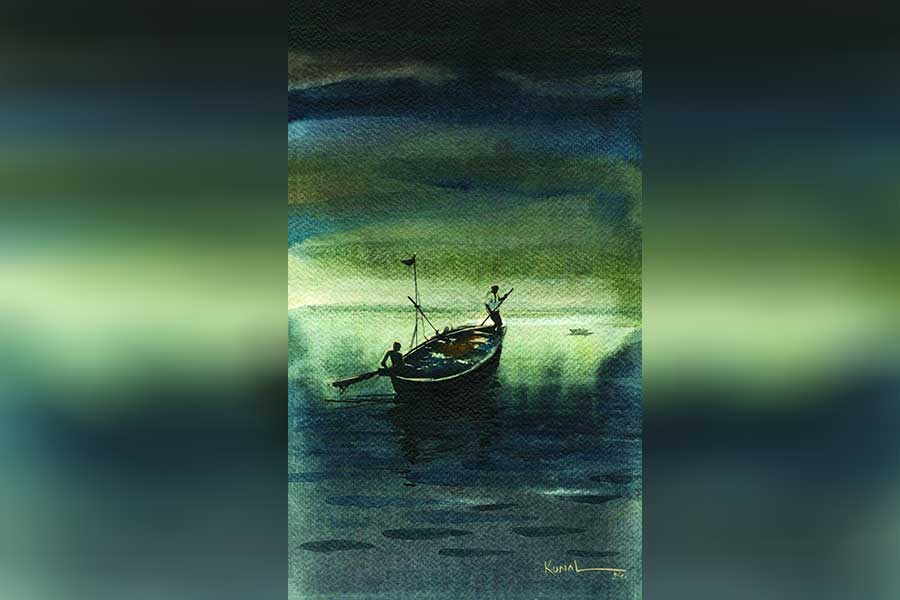

 
 <h1 align=center>হাকিমের চর</h1>
<h2 align=center>সব্যসাচী ধর</h2> অন্ধকারের বিদ্যেধরীতে ভয় লাগতে শুরু করল কুতুবের ছোট বুকে। আজ আম্মিকে নিয়ে প্রথম বার ও-পারে যাবে। এত দিন জলকে এ ভাবে ভয় লাগেনি তার। এর আগে এ নদী-সে নদীতে বাপের নাওয়ে চেপে কত বার মাছ ধরতে গেছে। বাপ খালেক পাড়ের গাছপালার দিকে হাত দেখিয়ে বলেছে, “ওই দেখ বাপ, ওটা বাইন, ওটা লতা সুন্দরী, এটারে কয় বাবলা।”

কখনও জলের দিকে তাকিয়ে বুঝিয়েছে, চোরাস্রোত কেমন করে চেনা যায়। জলের রং দেখিয়ে বুঝিয়েছে নদীর গভীরতা। কখনও বলেছে, কেমন করে যত্ন করতে হয় নাওয়ের গা-গতরের। আজ অন্ধকারে বিদ্যেধরীতে ডিঙিনৌকোয় বসে বাপের কথা ভাবতে ভাবতে কুতুবের মনে হল, আব্বু থাকলে বড় ভাল হত।

বহু বার এ-পার ও-পার করা আকিরারও নিকষ কালো এই নদীকে কেমন অচেনা লাগে আজ। ভয় হয় তারও। মনে হয়, আজ কুতুবের আব্বা থাকলে...! নিজের ভয় ছেলেকে বুঝতে দিলে আরও মুশকিল। তাই যতটা পারা যায় গলা স্বাভাবিক রেখে ছেলেকে জিজ্ঞেস করে, “ডরাও, বাপ কুতুব? ডর নাই! নায়ের পুত কি পানিরে ডর করে?”

যথেষ্ট ভয় করছিল কুতুবের। সেও ভাবল, এই ভয় আম্মিরে বুঝতে দিলে হবে না। গলাটা নামিয়ে বলল, “ডর লাগে না আম্মি, শুধু আন্ধার লাগে, দিশে পাই না।”

একটা বড় টর্চলাইট ছিল আকিরার হাতের কাছে। অবশ্য তাতে আর এখন তেমন আলোর তেজ নেই। সেটার সুইচে চাপ দিতে গিয়ে থেমে গেল আকিরা। আলো জ্বাললেও এখন বিপদ! আকিরাকে নিয়ে এ-পারে আসার প্রথম দিনেই এই টর্চলাইটের ইতিবৃত্তান্ত শুনিয়েছিল খালেক, “ভুবনজোড়া আলা রে এই লাইটের! আর বাজার থেকি কেনা লয়! এ আমাদের সরকারি জিনিস রে।” তার পর এই নিয়ে অনেক গল্প করেছিল ছইয়ের ভিতর জড়সড় হয়ে বসে থাকা নতুন বিবির সঙ্গে। বুঝিয়ে দিয়েছিল, যে-সে ঘরের ছেলে নয় তার নতুন লোকটি।

নৌকোয় বসে আকিরা অবাক হয়ে শুনেছিল, খালেকের বাবা হাকিম মিঞাকে ওই টর্চ দিয়েছিল এ-পারের থানার বড়বাবু। হাকিম ছিল এলাকার চৌকিদার। শুধু টর্চ নয়, মোটা চামড়ার একটা বেল্ট আর শক্তপোক্ত একখানা লাঠিও পেয়েছিল থানা থেকে। “কোমরে সেই বেল্ট পিঁদে লাঠি হাতে দাঁড়ালি, হালার বেটা চোর-ডাকাতই বল আর জোতদারই বল, সালাম ঠুকত আব্বারে!” এক হাতে দাঁড় ধরে অন্য হাতের বিড়িতে টান দিয়ে কথাগুলো বলেছিল খালেক।

তবে আড়ালে-আবডালে কেউ কেউ হাকিমকে গালমন্দ করে বলত, “শালা টিকটিকি! থানিদার!শালা চর!”

জলে-জঙ্গলে ভরা বিস্তীর্ণ এলাকায় হাকিমের নজর এড়িয়ে চোরাচালান, গাছ চুরি কিংবা জমি দখল মুশকিল ছিল। ঠিক সময়ে গোপনে থানায় খবর পৌঁছে যেত। নদীর এ-পারে একটু উঁচু চর এলাকা, হাকিমের ইন্তেকাল হলে সরকারের কাগজে কী করে যেন তার নাম হয়ে গেল ‘হাকিমের চর’।

বাপ মরলে অবশ্য ওই চৌকিদারের কাজটা আর পেয়ে ওঠেনি খালেক। সাদাসিধে খালেককে থানার বাবুরাও খুব ভালবাসত। হাকিম মারা যাওয়ার পর চৌকিদারের জিনিসপত্র থানায় জমা দিতে গেলে বড়বাবু বলেছিল, “ও টর্চ তোর কাছেই রাখ খালেক, ফেরত দিতে হবে না। তোর বাপ হাকিমের বুকের পাটা ছিল রে খালেক! তু তো একটা গাধা রে! সারা জীবন এই বাঘ শিয়াল সাপখোপের দেশে একমনে কাজ করে গেল সে। দেশের সেবা! কখনও কারে ডরায়নি। তুও তো নদীনালায়  ঘুরিস, বাপের মতো চোখ-কান খোলা রাখিস। এ দিক-সে দিক কিছু দেখলে আমারে জানাস। খবর দিলে দু’-দশটা টাকাও পাবি।”

ভাল মাছ জালে উঠলে, চাকভাঙা টাটকা মধু পেলে, শুধু এ-পারের থানায় নয়, বিদ্যেধরীর ও-পারের থানাতেও অবাধ যাতায়াত ছিল হাবাগোবা খালেকের। ও-পারের দারোগাবাবুও বেশ খাতির করত এ-পারের খালেককে। বলত, “চা খাও খালেক ভাই।” তার পর নদীর খবরাখবর নিত, এ-পারে থানার খবর নিত। খুঁটিয়ে খুঁটিয়ে জানতে চাইত এ-পারের হাল-হকিকত। খালেক বুঝতে পারত না দারোগার অভিসন্ধি। সে গড়গড় করে বলে আসত এ-পারের ঝুটঝামেলার কথা, চোর-ছ্যাঁচড়রা রাতের অন্ধকারে কখন চোরাই মাল নদীর বুকে ভাসানোর চেষ্টা করে, সেই সব। গম্ভীর ভাবে সব কথা শোনা হলে দারোগা বলত, “আবার আসবা, কখুনো জলপুলিশে ধরলি আমার নাম করবা, বলবা ‘আমি খালেক মউলি। থানায় মধু দিই।’ কেউ আর কিছু বলবে না।”

এ-পার ও-পার করতে করতে এক দিন ও-পারের থানার পাশের গঞ্জে নেয়ামত চাচার সঙ্গে আলাপ হয়েছিল খালেকের।

“মিয়ার ঘর কুনে গো?”

“ও-পারে, হেকিমের চর।”

“হেকিমের চর! নজরদার হেকিম? তারে চিনতাম মিঞা। বড় খোলতাই লোক ছিল সে।”

“আমি যে তার বেটা গো চাচা!” গর্বের সঙ্গে বলেছিল খালেক।

আলাপ পর্ব সারা হলে জানা গেল, খালেকের বিয়েশাদি এখনও হয়ে ওঠেনি। মা মারা গেছে কোন ছোটবেলায়। ঘরে একা মানুষ সে। কোথায় থাকে, কোথায় খায় তার কোনও ঠিকঠিকানা নাই। বড় মিঠে করে নেয়ামত বলেছিল, “আসো, বাপ আসো।”

তার পর বাড়ি নিয়ে গিয়ে বড় খাতির করে মাটির দাওয়ায় চাটাই পেতে বসতে দিয়েছিল। আলু বেরেস্তার সঙ্গে বোয়াল মাছের টক দিয়ে ভাত দিয়েছিল নেয়ামতের বিবি। বারকয়েক এমন মাছ-ভাত খাওয়ার পর নেয়ামতের মেয়ে আকিরাকে শাদি করে এ-পারে উঠেছিল খালেক।

দারোগা সম্পদ মুখুটি বলেছিল, “বিয়ে করলি খালেক, ভালই করলি। তবে এ-পারে তোর চাঁদবদনী জোটাতে পারলি না? দেশভাগেরপর যারা এসেছিল তারা এসেছিল, কিন্তু এখন যে কাগজপত্রের নানা ঝামেলা রে।”

“কী যে বলেন বড়বাবু! আপনি থাকতে আবার ঝামেলা কী?”

“না রে খালেক, এখন আর সে দিন নাই। পঞ্চায়েত প্রধানকে গিয়ে বল গা, বিয়ে করে বৌ এনেছিস ও-পার থেকে।”

সব শুনে খুব বকাঝকা করেছিল প্রধান। তার পর খালেককে বলেছিল, “পরে আসিস, দেখব কী করা যায়।”

একটা নদীর এ-পার ও-পার মাত্র। ভাল করে ঠাহর করলে ও-পারের গাছপালা গরু-ছাগল মানুষজন সবই তো দেখা যায়। তাতে আবার ভেদ কিসের, সেটাই বুঝতে পারেনি হাকিমের বেটা খালেক!

থানার পাশে ঠাকরুন পুজোর মেলায় সবাই এক সঙ্গে পাঁপড়ভাজা চা খায়। হিন্দু-মুসলমান সব মেয়েই চুড়ি-ফিতে কেনে। নতুন বৌ আকিরাকে নিয়ে মেলা দেখতে গিয়েছিল খালেক। চেনাজানা অনেকেই খালেককে জিজ্ঞেস করেছিল, “কবে শাদি করলা ভাই? কে দাওয়াত দিছিল?”

জনে জনে সবাইকে সে বলেছিল, “ওই তো ও-পারে, থানা লাগোয়া ধলাইল গাঁয়ে।” দু’-এক জন কাছের মানুষকে এটাও বুঝিয়েছিল, আকিরার একটা চোখের মণি সাদা, তাই একটা চোখে আঁধার। ও-পারে তার মতো ভাল পাত্র কই!

সবাই বুঝতে পেরেছিল, হাবাগোবা খালেক বড় ভুল করে ফেলেছে। মেলার মাঠে খালেকের দূর সম্পর্কের ফুফু কুসুম খুব গম্ভীর ভাবে বলেছিল, “আক্কেল নাই তোর! এখন আর অন্য দেশ থেকে কেউ বিবিনিয়ে আসে?”

রাতে শুয়ে শুয়ে খালেক ভেবেছিল, বড়বাবু বকে, ফুফু বকে, প্রধান চোটপাট করে, তাইলে উপায়? শেষমেষ সিদ্ধান্ত নেয়, তেমন কিছু হলে আকিরাকে নিয়ে ও-পারে গিয়েই বসত পাতবে। এক দিন পরবের সময় ও-পারে গিয়ে থানার বড়বাবুকে জিজ্ঞেস করেছিল, “সায়েব, হাকিমের চর ছেড়ি এ-পারে এলি, থাকতে দেবেন? ও-পারে সবাই গালমন্দ করে।”

সমাধান জোটেনি। বরং মজা করে দারোগা বলেছিল, “পায়ে পা লাগায় খুব ঝগড়া করবা বিবির লগে। তার পর বিবির গোঁসা হবে। সে বলবে, ‘বাপের বাড়ি যাব।’ দেরি না করে তারে এ-পারে রেখে যাবা। তুমি থাকবা তোমার দ্যাশে আর তোমার বিবি এ-পারে। মাঝে মাঝে থানায় এসে ও-পারের খবর দিবা, আর তার লগে দেখা করবা।”

“কী যে বলেন দারোগাবাবু! তারে ছেড়ি কি থাকন যায়!”

*****

মাসকয়েক পরেই কুতুবের জন্ম হয়েছিল এই বিদ্যেধরীর বুকেই খালেকের নাওয়ে। সে ঝড়জলের রাতে নদী ফুলে উঠেছিল, আর জোর ধাক্কা মারছিল গাছে বাঁধা খালেকের নৌকোয়। গাঁয়ের দাই হাকুবা বিবি সে দিন আবার কোনও কাজে বাইরে গেছিল। আকিরা বলেছিল, “শিগগির নাও খোলেন, ও-পারে চলেন।”

খালেক বুঝতে পেরেছিল, ঝড়-জলের রাতে জলকাদায় ভরা রাস্তা পেরিয়ে পাঁচ মাইল দূরের হাসপাতালে যাওয়ার চেয়ে ও-পারে যাওয়া বেশি সহজ। ‘বদর বদর’ বলে নৌকো ছাড়ার পরই স্রোতের ধাক্কা আর বিদ্যেধরীর গর্জন ছাপিয়ে একটা মিহি কান্নার আওয়াজ ঢুকেছিল খালেকের কানে। সে আওয়াজে জীবনে প্রথম বার একটা অদ্ভুত অনুভূতি হয়েছিল খালেকের। বাবা হয়েছিল খালেক। মা হয়েছিলতার বিবি।

পরদিন সকালে পুঁটলি জড়ানো কুতুবকে দেখে পাড়ার মাতব্বররা চাপা গলায় বলেছিল, “শিগগির মা আর ছাওয়ালরে ও-পারে পাঠায় দে নেয়ামত। ছাওয়ালের কাগজা যে ও-পারের লাগে।”

খালেক সমস্যাটা বুঝতে পেরেছিল। তার পর তুলতুলে কুতুবকে নিয়ে ফিরতি নৌকোয় হাজির হয়েছিল এ-পারের সদরের হাসপাতালে। সেখানে বলেছিল, “নৌকোয় জন্ম হয়েছে কুতুব মিঞার। বাপ-মায়ের নাম, আর সাকিন— হাকিমের চর।”

লিখে নিয়েছিল ওরা।

*****

কী সব কারণে এ দেশের রাজার সঙ্গে ও দেশের রাজার খুব মন-কষাকষি। বড় বিপদে পড়ে গেল কলাগাছে বাঁধা গরুর পাল আর নৌকোর পাটাতনের ভিতরে থাকা নিষিদ্ধ ওষুধগুলো। দু’পারের সেপাইরা গুলি চালিয়ে জানান দিলে তারা তক্কে তক্কে আছে। খালেকের মাথায় এ সব ঢোকে না। তার মধ্যে সীমানার হিসাব নেই। সে কখন যেন জলসীমা পার হয়। হাবাগোবা খালেকের গায়ে গুলি না লাগলেও ধরা পড়ল ও-পারের সেপাইদের হাতে। জোড়হাত করে বললে, “আমি খালেক মউলি, হাকিমের চরের লোক, ধলাইলের নেয়ামত শেখের জামাই। আপনাদের দারোগাবাবুকে মাছ আর মধুদিই গো!”

থানায় সেই পরিচিত দারোগাকে বিহ্বল দৃষ্টিতে খুঁজেছিল সে। খালেকের সেই পরিচিত দারোগার ট্রান্সফার হয়ে গেছিল কিছু দিন আগে। আর এই অপাঙ্‌ক্তেয় লোকটাকে কে-ই বা আর মনে রাখে!

“হালা! চরের বেটা চর! খবর পাচার করিস!” বলে কোমরে দড়ি বেঁধে তাকে চালান করলে সদরে।

দু’-চার দিন পরে আকিরা খবর পেল। প্রধান কী ভাবে যেন জানতে পেরেছিল খালেকের খবর। সে-ই আকিরাকে জানিয়েছে। এই দশ-বারো বছরে হাকিমের চরে নতুন বসতি তৈরি হয়নি। বরং বার বার ঝড়ে আর বানে ধুয়ে-মুছে গেছে এলাকা। যে দু’-চারটে ঘর ছিল, তারাও উঁচু জায়গায় ঘর পেতেছে।

কুতুবকে নিয়ে থানা, পঞ্চায়েত এবং চেনাজানা মানুষের কাছে গিয়ে হাতজোড় করে বলেছিল, “সে বড় সাদাসিধা, বড় ভালমানুষ, তারে এনে দেন গো বাবুরা!”

এ-পারের নতুন দারোগা বলেছিলেন, “তোমার কাগজপত্রের নকল দিয়ে একটা আবেদন করো। আমি ডি এম সাহেবকে পাঠিয়ে দেব। কিছু একটা ব্যবস্থা নিশ্চয়ই হবে। ধৈর্য রাখতে হবে।”

আকিরার এ দেশের কোনও কাগজ নেই শুনে দারোগা হতাশ হয়ে বলেছিলেন, “তা হলে তোমার বেটা আবেদন করতে পারে।”

“বাপ কুতুব, তোর বাপকে কোথায় নিয়ে গেল রে! সে যে অচিন দেশের কিছুই জানে না, হায় আল্লা!” খুব কেঁদেছিল ক্ষীণদৃষ্টি আকিরা। তার পর সদ্য-কিশোর কুতুব আর তার মা রাতের বেলায় পরিকল্পনা করেছিল, যেমন করেই হোক ও-পারে যেতে হবে। থানা-পুলিশের কাছে গিয়ে হাতজোড় করে বলবে, ‘ওরে ছেড়ি দ্যান বাবুরা।’ তাকে ও দেশেরপুলিশে ধরবে না। ধলাইলের মেয়ে বললে নিশ্চয়ই ছেড়ে দেবে। কুতুব তাকে ও-পারে নামিয়েই চলে আসবে। ফিরে এসে প্রয়োজনে সে মসজিদের পাশে এতিমখানায় কিছু দিন থাকবে। তার পর তো এক দিন তার বাপ দেশে ফিরবেই।

একটা ছোট ডিঙিনৌকোও ছিল খালেকের। এটায় করে বাপ-বেটায় মাছ ধরতে যেত খালে-বিলে। সেটায় চেপেই মা আর ছেলে আজ প্রথম বিদ্যেধরী পার হবে।

গভীর অন্ধকারে নাও ছাড়ে কুতুব। আকিরা সেই টর্চলাইটটা হাতে ধরে বসে। বুকে চেপে ধরে সেটাকে। এক দিন খালেক বলেছিল, “ভুবনজোড়া আলা রে এই লাইটের!”

ভাবতে ভাবতে চোখ থেকে জল গড়িয়ে পড়ে আকিরার।

হঠাৎ মাঝনদীতে কেমন যেন ঘুরপাক খেতে শুরু করে ডিঙিটা। অন্ধকারে কুতুব বুঝতে পারে না যে, সে প্রবল ঘূর্ণিস্রোতে পড়ে গেছে। এ নদীর স্রোত সম্বন্ধে সে কী-ই বা জানে! বেসামাল নৌকো ঠিক করতে না পেরে সে বিকট চিৎকার করেওঠে, “আম্মি!”

“কী হল বাপ কুতুব! ভাল করি হাল ধরো বাপ আমার।”

“আম্মি!”

“বাপ কুতুব!”

“আম্মি-ই...!”

কেউ কিছু বুঝতে পারে না। কোথাও কোনও চিহ্ন থাকে না। নিকষ কালো অন্ধকারে বিদ্যেধরীর বুকে কয়েকটি বুদবুদ মাত্র, তাও খুব দ্রুত অন্ধকারে মিলিয়ে যায়।

বহু বছর ও-পারে জেল খেটেএক দিন খালেক ফিরে এসেছিল হাকিমের চরে। খুব খুঁজেছিল বৌ-বেটাকে... খুব!