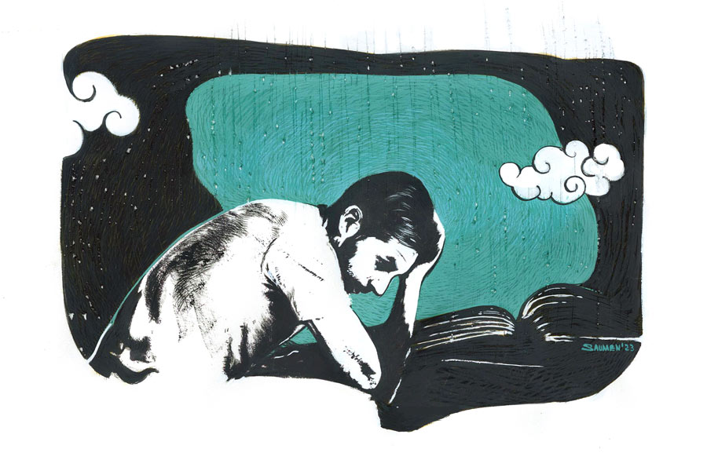

 
 <h1 align=center>হিমযুগ</h1>
<h2 align=center>অংশু পাণিগ্রাহী</h2> রেললাইনের পাশে এক টুকরো জমি ছিল আমাদের। বাবা এক কালে চাষবাস করেছে। আলু, ঝিঙে, টমেটো ইত্যাদি। এখন আর ক্ষমতায় কুলোয় না। বাবা ফুসফুসের সমস্যায় কাবু।

সেই জমি রেখে কী হবে? আমি অনার্স, গ্র্যাজুয়েট। সরকারি স্কুলে মাস্টারির স্বপ্ন শরীরের প্রতিটি পরমাণুতে। আমি কি চাষে নামব? ও জমি বেচলে বরং বি এড-এর খরচটা উঠে আসবে।

বাবা শয্যাশায়ী। সারা দিন শুয়ে থাকে, ঘঙ-ঘঙ করে কাশে আর বিড়ির ধোঁয়া ছাড়ে। গাঁয়ের হাতুড়ে বলাই মণ্ডল জবাব দিয়েছে। এ রোগী সারানো তার সাধ্যের বাইরে। কলকাতার ডাক্তার দরকার। সঙ্গে নানাবিধ টেস্ট, ওষুধ। অর্থ চাই।

অর্থের সম্ভাব্য উৎস রেললাইনের পাশের জমি। আমার বি এড? না কি বাবার চিকিৎসা? কোনটা আগে? মা প্রস্তাব দিল, জমিটা বিক্রি করা যাক, তার পর সিদ্ধান্ত নেওয়া যাবে।

জমি বিক্রি হল। সামান্য সওয়া লাখ। এ দিয়ে দুই নৌকো এক সঙ্গে চলবে না। বিনা চিকিৎসায় বাপটা মারা যেতে পারে। তবু আমি গোঁজ হয়ে রইলাম। পাতি বাংলা অনার্স আমার। রেজ়াল্টের যা ছিরি, মাস্টার্সে সুযোগ হয়নি। এখন বি এড-টুকুও যদি কপালে না জোটে, একেবারে ফুটুরডুম! কী করি এখন?

বাবা অবশ্য বেশি বাদানুবাদে গেল না। বিড়ির ধোঁয়া ছেড়ে ঘঙ-ঘঙ কাশির মধ্যেই বলল, “বলাই একটা গবেট। আরে আমার কী রোগ হয়েছে আমি জানি। ওই হুমোপ্যাথি পুরিয়াতেই যা হওয়ার হবে। আর সব চেয়ে বড় ওষুধ তো এটা...” বলে হাতে ধরা বিড়ির টুকরোটা দেখিয়ে দু’রাউন্ড ধোঁয়া ছাড়ল।

“পরে বলবে না তো, জমি বিক্রির টাকা ছেলে গাপ করেছে?”

“আরে না। তুই মাস্টার হলে আমাদেরও আনন্দ। তুই লেগে যা। ‘জয় মা কালী’ বলে ঝুলে পড়।”

ব্যস। এর পর আর কোনও কথা চলে না।

কমলিনী আমার সঙ্গেই ভর্তি হল। তার অবশ্য অর্থচিন্তা নেই। দেশে যত রকমের ব্যাঙ্ক আর পোস্ট অফিস, সবেতেই কমলিনীর বাবার অ্যাকাউন্ট। অগাধ টাকা!

কমলিনী আমার সঙ্গেই স্কুলে পড়েছে, অনার্স করেছে আর এখন বি এডও। মাস্টারি নিয়ে আদিখ্যেতা নেই। মাস্টারি পেলেও চলে, না-পেলেও চলে। মোট কথা একটা শাঁসালো চাকরি চাই তার। তার জন্য যত রকমের কোর্স করা দরকার, সে করবে। নিজের জোরে টাকা না করতে পারলে কেউ নাকি পাত্তা দেয় না। অগত্যা কমলিনীও বি এডে।

ভালয়-মন্দয় দু’টো বছর কেটে গেল। বি এড শেষ। এ বার?

বি এড করে কমলিনী সাকুল্যে শিখেছে শাড়ি পরা, শাড়ি সামলানো। আর আমি শিখেছি এক আশ্চর্য কলা। মাছকে খাবার খাওয়ানোর কৌশল। স্কুল ইন্টার্নশিপের জন্য যে স্কুলটিতে যেতে হয়েছিল, সেখানকার হেডস্যর হাতে ধরে শিখিয়েছিলেন। স্কুলের পুকুরে মাছ চাষ হত। কয়েক জন শিক্ষক ‘শেয়ারে’ মাছ ছাড়তেন কিনা!

স্কুল সার্ভিসের পরীক্ষার জন্য অপেক্ষা না করে আমি আর কমলিনী ব্যাঙের ছাতার মতো যত্রতত্র গজিয়ে ওঠা প্রাইভেট স্কুলগুলোয় হানা দিতে লাগলাম। কমলিনী একটা স্কুলে সুযোগও পেয়ে গেল। আমি ছেঁড়া ঘুড়ির মতো ধাক্কা খেতে-খেতে উড়তে লাগলাম এ দিক-ও দিক। ইতিবাচক কিছু ঘটল না।

এ দিকে রোজগার তো করতেই হবে। আমাকে দেখলেই বাবার কাশির মাত্রা বেড়ে যায় আর সেই সঙ্গে ধোঁয়ার ঘনত্বও। দাবিটা পরিষ্কার।

অতএব টিউশনি। মফস্‌সলে শুধুমাত্র বাংলা বিষয়ের জন্য কে-ই বা মাস্টার রাখে! বাংলার সঙ্গে ইতিহাস, ভূগোলের প্যাকেজ চাই। তাতেও আমি রাজি। একটা টিউশনি জুটল। ক্লাস নাইন।

শিক্ষার্থী দেবোপমা বেজায় অন্যমনস্ক। লেখাপড়া বাদে ওই বয়সে যা-যা করা সম্ভব এক জন চতুর্দশীর পক্ষে, সবই করে। যা-যা সম্ভব নয়, তাও। বকাবকিতে কাজ হয়নি। লজ্জা-লজ্জা মুখ করে হেসেছে। ওইটুকুই।

দেবোপমার মা অমায়িক মহিলা। আয়তনে বিপুল। চলাফেরা করেন না খুব একটা। কাজের মেয়েকে দিয়ে খাবার পাঠিয়ে দেন। একটা প্লেটে তিনটে থিন অ্যারারুট বিস্কুট আর কাপে লাল চা।

দেবোপমা এক দিন ফিসফিস করে বলল, “আপনার সঙ্গে বৈষম্য করা হচ্ছে!”

“অ্যাঁ!” বিষম খেলাম আমি।

“সায়েন্সের স্যরের জন্য লুচি, তরকারি, মিষ্টি ইত্যাদি থাকে। আর আপনার জন্য শুধুই বিস্কুট!” দেবোপমা যেন কেঁদেই ফেলবে আমার দুর্দশায়।

“কেন বলো তো? আমার সঙ্গে এমনটা হচ্ছে কেন? পড়াতে পারি না বুঝি!” নিজের দক্ষতার প্রতি সন্দেহ হচ্ছিল আমার।

“হবে না কেন! উনি যে স্কুলের টিচার,” বলল দেবোপমা।

আর এক দিন বিশাল বপু নিয়ে হাঁপাতে-হাঁপাতে দেবোপমার মা স্বয়ং দর্শন দিলেন, “আজ কাজের মেয়েটা ডুব মেরেছে। তুমি খালি মুখে চলে যাবে, তাও কি হয়? আমার অবস্থা তো দেখছ, তোমার ছাত্রীও একটি অকম্মার ঢেঁকি। তাই তুমি যদি…”

মহিলা কী বলতে চাইছেন?

“তুমি যদি নিজেই দু’কাপ চা… আমিও তা হলে একটু খেতে পাই!” গলা বুজে আসছিল মহিলার।

“আমার জন্যও এক কাপ!” দেবোপমার অনুরোধ।

তিন কাপ চা হল। চা খেয়ে মহাখুশি মহিলা নিজের ঘরে ঢুকে পড়লেন। দেবোপমাও প্রশংসাসূচক দৃষ্টিতে তাকাচ্ছে ঘন ঘন। পড়ায় মন নেই। উসখুস করছে বড্ড।

“কী ব্যাপার? কিছু বলবে?” বলতে বাধ্য হলাম।

“চলুন, আমরা কোথাও পালাই...” নির্বিকার ভাবে বলল সে।

“পালাব কেন? এখানে পড়তে ভাল লাগছে না? গাছের তলায় গিয়ে পড়তে চাও?”

“চলুন, ঘর বাঁধি।”

“অ্যাঁ!” বলে কী দেবোপমা!

“আপনি খুব ভাল চা করেন।”

“তাতে কী হল?”

“আমার বেস্ট ফ্রেন্ড ত্রিপর্ণা বলেছে, যে পুরুষ ভাল চা করে তার হাত ছাড়তে নেই। তারা কেয়ারিং হয়… একটু বসুন, আমি আসছি।”

দেবোপমা বোধ হয় ব্যাগ গোছাতে গেল। সেই সুযোগে নিষ্ক্রমণ এবং পলায়ন। আর কোনও দিন ওমুখো হইনি। আমার মতো ডুবন্ত কাঠবেকারের জন্য শেষতম কুটোটিও হাতছাড়া হল।

এ ভাবে আরও বছরখানেক কাটল। স্কুল সার্ভিসের নামগন্ধ নেই। অন্যান্য কম্পিটিটিভ পরীক্ষা দু’-এক বার দিয়েছি। ইংরেজি আর অঙ্ক, দুটোতেই আমি ভোম্বল। তাই বিশেষ সুবিধে হওয়ার কথা নয়। হয়ওনি।

হাতে টিউশনি নেই। উপার্জন বন্ধ। পেট কি আর সে-সব বোঝে? পেটের মতো অবাধ্য আর হ্যাংলা জিনিস দ্বিতীয়টি নেই।

অতএব পাড়ারই এক কেটারিং-এর দলে ভিড়লাম। বিয়েবাড়ি। দু’রাতে হাজার দেবে। মাংসে মশলাপাতি মাখানোর দায়িত্ব পেয়েছিলাম। কাঁচালঙ্কা চটকাতে গিয়ে পাক্কা তিন দিন সে কী হাতের জ্বলুনি! আর যাওয়া হয়নি কাজে।

কমলিনী প্রাইভেট স্কুলে পড়াচ্ছিল চুটিয়ে। এক দিন ওর এক দূরসম্পর্কের মেসোর কাছে নিয়ে গেল। মেসো নাকি মস্ত রাজনৈতিক নেতা! আমাদের এ দিকে পার্টির কাজে মাসে দু’-এক বার আসেন।

নেতা মেসোমশাই তেলেভাজা আর মুড়ি খাচ্ছিলেন। আমরা প্রণাম করতেই বললেন, “হ্যাঁ হ্যাঁ, ঠিক আছে। বোসো। ফোনে যার কথা বলেছিলে, এই কি সেই ছোকরা?”

কমলিনী ইতিবাচক মাথা নাড়তে মেসোমশাই বললেন, “শুরু করো।”

কমলিনী চিমটি কাটল আমার কোমরে। আমি মুখটাকে করুণ করে বললাম, “স্কুল সার্ভিস তো হচ্ছে না মেসোমশাই…”

মেসোমশাই প্রায় লাফিয়ে উঠলেন চেয়ার ছেড়ে, “নেতাসাহেব! নেতাসাহেব বলবে আমাকে। তোমার মেসোমশাই নই আমি। খবরদার! এর পর যদি ফের মেসোমশাই বলে ডেকেছ, কান ধরে বের করে দেব।”

আমার মুখ শুকিয়ে গেল। তুতলে বললাম, “ইয়ে, সরি স্যর, মানে নেতাসাহেব। একটা বেসরকারি স্কুলের ব্যবস্থা যদি করে দেন! কোথাও চান্স করতে পারছি না।”

নেতাসাহেব চোখ বুজে পেঁয়াজি চিবোচ্ছিলেন। আমার কথা শেষ হতেই মুখ বিকৃত করে সেক্রেটারি গোছের কাউকে বললেন, “এটা পেঁয়াজি হয়েছে? রবারের টায়ার না জানোয়ারের চামড়া কী চিবোচ্ছি বোঝা দায়! তোমাদের এই এলাকার বাপু এই এক সমস্যা, মহাদেব। তেলেভাজাটা একেবারেই করতে পারো না তোমরা। এটা একটা আর্ট, শিল্প। যার তার কম্মো নয়। হবে না তোমাদের দ্বারা।”

কমলিনীর দিকে আড়চোখে তাকালাম। সে আবার চিমটি কাটল।

নেতাসাহেব এ বার আমার উদ্দেশে বললেন, “দেখো ছোকরা, চাকরি মানে কী?”

আমি ঢোঁক গিললাম।

“চাকরি হল গিয়ে চাকরগিরি। চাকরগিরি ইজ় ইকোয়াল টু দাসত্ব। দাসপ্রথা উচ্ছেদের জন্য দেশে-বিদেশে কত আন্দোলন হয়েছে জানো? আর তুমি সাধ করে দাসত্বের বেড়ি পরতে চাও! শেম অন ইউ!” নেতাসাহেব ধমকালেন।

“আসলে ওর বাড়ির আর্থিক অবস্থা…” কমলিনী আমার হয়ে বলার চেষ্টা করল।

“বাড়ির অবস্থা আমারও কি ভাল ছিল? বাপ ছিল পাঁড় মাতাল। এক-এক দিন চাল কেনার পয়সায় মাল কিনে আনত। সেই সব রাতে বাপের সঙ্গে আমাকেও মাল খেয়ে… ”

কমলিনীর গলাখাঁকারি শুনে নেতাসাহেব প্রসঙ্গ পাল্টালেন।

“শোনো ছোকরা, তুমি বরং একটা চপ-তেলেভাজার দোকান করো। মূলধন লাগে না ওতে। সঙ্গে চা-ও রেখো। টাকা গুনতে-গুনতে আঙুলে বাত ধরে যাবে। টাকা গোনার জন্য আলাদা কর্মচারী রাখতে হবে। আমাদের পাড়ায় চা-চপ বিক্রি করে কত লোকজন পাঁচতলা বাড়ি তুলছে! তা ছাড়া তোমাদের এলাকার চপ অতি অখাদ্য। একটু চেষ্টা করলেই একচেটিয়া সাম্রাজ্য হবে তোমার।”

“আমি আসলে এ সব পারব না!”

“ও। মানে লাগবে? শিক্ষিত ছেলেপুলে বুঝি খাবারের দোকান করে না? খবরে দেখোনি, ‘এম এ পাশের মাটন রোল’, ‘গ্র্যাজুয়েটের গরম জিলিপি’, ‘বি কম-এর বেগুনি’? এদের কি মান-সম্মান নেই?”

এর পর কথা বাড়ানো বৃথা। নেতাসাহেবকে প্রণাম জানিয়ে আমি আর কমলিনী বেরিয়ে এলাম।

দিন কেটে যায়। বছর ফুরোয়, নতুন বছর শুরু হয়। আমাদের অবস্থার উন্নতি হয় না। যারা আমার মতো শিক্ষকতা করতে চায়, অন্যান্য কাজে মন বসাতে পারে না, তাদের জন্য হতাশা ছাড়া কিছুই অবশিষ্ট নেই। রাস্তাঘাটে বেরোতে পারি না। বন্ধুবান্ধবরা মুখে বিষাদের প্রলেপ মেখে ঘোরে। তাদের মুখ দেখলেই ভিতর অবধি কেঁপে ওঠে। যদি চাকরি না পাই? গত কয়েক বছরে স্কুল সার্ভিসের পরীক্ষা একটিও হয়নি। অপেক্ষা করতে করতে প্রত্যেকেই এখন অবসাদগ্রস্ত। কেউ কেউ যুদ্ধক্ষেত্র থেকে সরেও পড়ছে।

কমলিনীর মতো মেয়েও ফ্রাস্ট্রেশনে ভুগছে। মফস্সলের প্রাইভেট স্কুলে কতটুকুই বা মাইনে দেয়! প্রায়ই বলে, “আর পারছি না রে, কত দিন এ ভাবে! বয়ফ্রেন্ডও তাড়া দিচ্ছে। ওর বাবা-মায়ের বয়স হচ্ছে। আমাদেরও তিরিশের কোঠায়। এর পরে বাচ্চাকাচ্চা কনসিভ করা চাপের। কমপ্লিকেশন হবে।”

কোনও রকমে টিকে আছি। টুকটাক পড়াশোনা চলছে। সঙ্গে রোজগারের ধান্দায় হরেক কাজ।

নেতাসাহেবের বাণী অনুসরণ করে চপ ভাজারও চেষ্টা করেছিলাম। ভাঙা ঠেলাগাড়িতে দোকান। নাম ‘বি এডের ভ্রাম্যমাণ চপ গাড়ি’। তেলে বোধহয় ভেজাল ছিল। আমার দোকানের চপ খেয়ে পাড়াসুদ্ধু লোকের আমাশা। ব্যবসা লাটে।

কোনও এক আশ্চর্য জাদুবলে বাবা এখনও বেঁচে আছে। সম্বল বলতে কাশি, বিড়ির ধোঁয়া। আর এক রাশ স্বপ্ন। আমি এক দিন সরকারি স্কুলে মাস্টারি পাব, আর কোনও চিন্তা থাকবে না ইত্যাদি। বলাই ডাক্তার গত হয়েছে। তার স্ত্রী এখন চেম্বারে বসে। বাবার ‘হুমোপ্যাথি’ চিকিৎসা তাই চালু আছে।

এরই মধ্যে এক দিন কমলিনী আমাদের বাড়ি এসে বিয়ের কার্ড দিয়ে গেল। সামনের বৈশাখেই শুভ পরিণয়। বলে গেল, “ভেবেছিলাম বড়সড় কিছু হব। তার পর বিয়ের কথা ভাবব। কিন্তু কী যে হয়ে গেল! আসলে মানুষের হাতে কিছুই থাকে না। আমরা সময়ের, পরিস্থিতির হাতের পুতুল। তাই না রে?”

আরও এক সৈনিক যুদ্ধক্ষেত্র ছাড়ল। ছাড়তে বাধ্য হল। 

আমি বড় অসহায়, একা। দিগন্ত পেরিয়ে কালো ঘোড়ায় চেপে লক্ষ লক্ষ শত্রুসেনা এগিয়ে আসে আমার দিকে। সবাই মিলে আমাকে কচুকাটা করবে। মনের মধ্যে টিমটিম করে আশার যে ক্ষীণ শিখাটুকু জ্বলছিল, তাও নির্বাপিত। চার দিক অন্ধকার। ঘুটঘুটে অন্ধকারে আমি নিজেকে দেখতে পাই না। মাথা গুঁজে বসে থাকি পড়ার টেবিলে। শীত করে বড্ড। এই হিমযুগের কি কোনও শেষ নেই?

পাশের ঘর থেকে ঘঙ-ঘঙ শব্দ শোনা যায়। বিড়ির কড়া গন্ধ ঝাপটা মারে নাকে। বাবা জেগে আছে। জমির টাকা আমার হাতে তুলে দিতে বিন্দুমাত্র দ্বিধা করেনি আমার জন্মদাতা। বিনিময়ে কী পেল?

ঝেড়েঝুড়ে উঠি আমি। আবার এক চক্রে প্রবেশ করতে হবে। কমলিনীর মতো কোনও সহযাত্রী নিশ্চয়ই জুটে যাবে। আবার হয়তো দেবোপমার মতো কাউকে পড়াব, আবার কোনও নেতাসাহেবের কাছে যাব, চপ ভাজব, বিয়েবাড়িতে গিয়ে মাংস মাখব, জ্বলে যাবে হাত, আবার সহযাত্রীর সঙ্গচ্যুত হব… চক্র শেষ হবে। নতুন চক্র শুরু হবে।

আবার। বার বার…