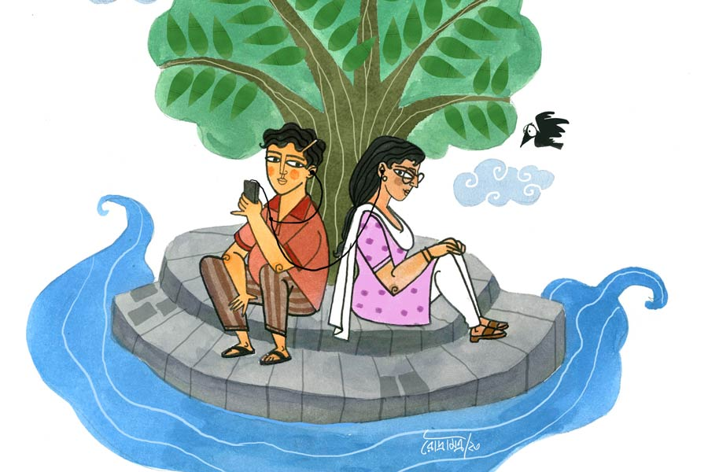

 
 <h1 align=center>হিয়ার মাঝে</h1>
<h2 align=center>অরুণাভ দত্ত</h2> যে  ছিল আমার স্বপনচারিণী, তারে বুঝিতে পারিনি…’ অর্পণ আর পাপড়ি পাশাপাশি বসে গানটা শুনছে। অর্পণের মোবাইলের সঙ্গে যুক্ত হেডফোন শেয়ার করেছে দু’জনে। বিকেলে গঙ্গার ধারে বসে হাওয়া খেতে খেতে ওরা প্রায়ই গানটা শোনে। তখন ওদের মনের ক্যানভাসে অস্পষ্ট ভেসে ওঠে দুটো মুখ। অর্পণ ভাবে ওটা ঋষিতা, আর পাপড়ি ভাবে ওটা নিশ্চয়ই রণদীপ। অর্পণ মনে-প্রাণে বিশ্বাস করে ঋষিতা ওকে ভালবাসে; আর পাপড়িও ভাবে, রণদীপ যদি ওকেপ্রোপোজ় করত!

অর্পণ আর পাপড়ি, পরস্পরের প্রতিবেশী। ছেলেবেলা থেকেই খুব ভাল বন্ধু। ওদের বিশ্বাস, ওরা একে অপরের সমস্ত গোপন তথ্য জানে। অর্পণ প্রেমে পড়েছে ওর কলেজের একটি জুনিয়র মেয়ের। আর পাপড়ি ওদের কোচিংয়ের সবচেয়ে হ্যান্ডসাম ছেলেটির প্রেমে হাবুডুবু। কিন্তু কেউই মুখ ফুটে মনের কথা বলতে পারছে না। 

গান শুনতে শুনতে পাপড়ি অর্পণের কাঁধে মাথা রাখে। অর্পণ মাথা সরিয়ে নিয়ে বলে, “সব উকুন আমার মাথায় ঢুকিয়ে দে!”

“আমি ঋষিতা নই! সপ্তাহে তিন দিন শ্যাম্পু করি!” ফোঁস করে ওঠে পাপড়ি। তার পর আনমনা হয়ে বলে, “রণদীপ কি আমার মনের কথাবুঝবে না?”

“তার আগে তুই বল, ঋষিতার মনে কি আমার জন্য জায়গা আছে?”

“কার মনে কী আছে, তা আমি কী করে জানব?”

“তুই তো মেয়ে! মেয়েরাই তো মেয়েদের মনের কথা বোঝে।”

“তুইও তো ছেলে...”

“একশো বার! তাই তো তোকে বলি, রণদীপ যথেষ্ট হ্যান্ডসাম। তোর মতো খেঁদি-পেঁচিকে ও পছন্দ করতে যাবে কেন?”

“ফর্সা হলেই সব মেয়ে সুন্দর হয় না! ওই গরুটাও তো ফর্সা,” দূরে দাঁড়িয়ে থাকা সাদা গরুটা দেখিয়ে পাপড়ি বলে, “ওকে বিয়ে কর!”

পাপড়ি ঋষিতার মতো ফর্সা নয় বটে, তবে তার শ্যামবর্ণ ফুটফুটে মুখখানা যে ভারী মিষ্টি, তা অর্পণ বেশ জানে। সে বলে, “এই তোদের দোষ! সুন্দরকে সুন্দর বলতে পারিস না।যাক গে, ছ’টা বেজে গেছে! চল, ক্লাস শুরু হয়ে যাবে।”

কোচিং যাওয়ার পথে ষষ্ঠীতলার মোড়ে রণদীপকে দেখা গেল। বাইকে বসে সিগারেট খাচ্ছে। ওকে দেখেই পাপড়ি থমকে দাঁড়িয়েছিল। ওর ভুরুতে ভাঁজ। সেটা খেয়াল করে অর্পণ বলল, “লুকিয়ে মদও নাকি খায় শুনেছি।”

পাপড়ি মুখ বেঁকিয়ে বলল, “হ্যান্ডসাম ছেলেদের একটু-আধটু নেশা থাকে। তুই কী বুঝবি, তুই যা গোবরগণেশ! এক মাথা নারকেল তেল, কুমড়োপটাশের মতো ভুঁড়ি...” বলে হনহন করে এগিয়ে গেল পাপড়ি।

অর্পণের গা চিড়বিড় করে উঠল। তখনই রণদীপ বাইকটা চালিয়ে নিয়ে এসে ওদের সামনে দাঁড়াল আর পাপড়ির উদ্দেশে বলল, “লিফট?”

“আর তো তিন পা হাঁটলেই কোচিং। ওইটুকু ও হেঁটে যেতে পারবে,” বলে বসল অর্পণ। কুমড়োপটাশ শুনে ওর মাথা গরম।

পাপড়ি বিরক্ত চোখে তাকাল অর্পণের দিকে।

“ক্লাসে দেখা হচ্ছে...” হুস করে বেরিয়ে গেল রণদীপ।

“ইডিয়ট একটা!” আফসোস আর বিরক্তি মাখামাখি পাপড়ির কণ্ঠে। অর্পণের মনে তখন অনাবিল আনন্দের ঝর্নাধারা। 

কিছু দিন পর ফের সেই ঘটনা।

“লিফট?” কম্পিউটার ক্লাস থেকে বাড়ি ফেরার পথে পাপড়িকে অফারটা দিল রণদীপ। পাপড়ি সলজ্জ ভাবে হাসল। তার পর রণদীপের কাঁধে ভর দিয়ে বাইকে উঠে বসল। রণদীপের কোমরটা জাপ্টে ধরে রেখেছে পাপড়ি। অর্পণের নাকের সামনে দিয়ে রণদীপ যখন পাপড়িকে নিয়ে বেরিয়ে গেল, তখন অর্পণের মনে হচ্ছিল, ওর বুকের মধ্যে যেন অনেকগুলো পোকা কামড়াচ্ছে। সে মরিয়া হয়ে উঠল, ঋষিতাকে বলতেই হবে মনের কথা। পরদিন সন্ধ্যায় কম্পিউটার ক্লাস থেকে একাই ফিরছিল অর্পণ। পিছন দিক থেকে পাপড়ি দ্রুত হেঁটে এসে ওর কাঁধে মৃদু ঠেলা দিল, “দাঁড়ালি না?”

“কেন, রণদীপ পিক-আপ করতে আসেনি?” অর্পণের গলায় ঝাঁঝ। 

“কী হয়েছে তোর?”

“একটা আনকোরা ছেলের বাইকে উঠে ও ভাবে জাপ্টে ধরে বসতে হয়? আদিখ্যেতা!” অর্পণ কিন্তু জানে বাইকে বসতে ভয় পায় পাপড়ি। ওর দাদার বাইকেও ওই ভাবেই বসে।

“বেশ করেছি। দেখলাম তো সে দিন রোল কর্নারে বসে ঋষিতাকে রোল খাওয়াচ্ছিলি। আবার ঋষিতার বসার আগে জায়গাটা রুমাল দিয়ে মুছে দিলি। তুইও কি আদিখ্যেতায় কম যাস?” ওরা বিরক্ত মুখে পরস্পরের দিকে চেয়ে রইল।

দিন কয়েক পরে পাপড়িদের ছাদে জরুরি বৈঠক। সামনেই ভ্যালেনটাইন’স ডে। অর্পণ ঠিক করেছে ঋষিতাকে নিয়ে ঘুরতে যাবে। ঋষিতাও রাজি। অর্পণ খুব এক্সাইটেড। পাপড়ির কাছে ও পরামর্শ নিতে এসেছে আর এসে জানতে পেরেছে, রণদীপও পাপড়িকে প্রস্তাব দিয়েছিল সে দিন তার সঙ্গে বেড়াতে যাওয়ার জন্য। পাপড়ি হ্যাঁ বলে দিয়েছে।

“কোথায় নিয়ে যাবে?”

পাপড়ি উত্তরে বলল, “জানি না। তুই আর ঋষিতা কোথায় যাচ্ছিস?”

“সেটা ও ঠিক করেছে। ‘কসমস’ বলে কী একটা জায়গা।”

“‘কসমস’? তোরা কি গ্রহ, নক্ষত্র দেখতে যাচ্ছিস?”

“কী জানি! ওর জন্য কি গিফট নিয়ে যাব সেটাই ভেবে পাচ্ছি না।”

“‘কসমস’-এ যাচ্ছিস যখন, একটা ভাল দূরবিন কিনে নিয়ে যা।”

“ইয়ার্কি মারিস না।”       

“ঋষিতার জন্য একটা গিফট তৈরি করে দেব, সেটা দিস। দেখিস, ওর পছন্দ হবে।”

অর্পণ জানে, পাপড়ি খুব ভাল আঁকে। হাতের কাজও খুব সুন্দর। অর্পণ নিশ্চিন্ত হল। সেও পাপড়িকে একটা ছোট্ট সাজেশন দিল, “পুজোয় তোর ছোটপিসির দেওয়া গোলাপি রঙের কুর্তিটা পরে যাস।”

ভ্যালেনটাইন’স ডে-র বিকেলে নোটনের চায়ের দোকানের সামনে পাপড়ি অপেক্ষা করছিল। দূর থেকে একটা ছেলেকে আসতে দেখে প্রথমে চিনতে পারেনি। ছেলেটা আরও কাছে এলে পাপড়ির চোখ কপালে। অর্পণকে যে চেনাই যাচ্ছে না আজ! সেই হাবলু-গুবলু ছেলেটার নতুন স্টাইলে ছাঁটা চুল, চোখে কালো সানগ্লাস, পরনে লাল রঙের টি-শার্ট, তার উপর কালো জ্যাকেট, ন্যারো ফিট জিন্স, পায়ে লাল স্নিকার। অর্পণের দিকে কিছু ক্ষণ হাঁ করে তাকিয়ে রইল পাপড়ি। অন্য দিকে পাপড়ির পরনে অর্পণের পছন্দের পোশাক, কপালে ছোট্ট টিপ, আর ছোট্ট করে বাঁধা চুলের খোঁপা। অর্পণ প্রশ্ন করে, “কেমন লাগছে?”

“চুলটা এ রকম করে কেটেছিস কেন?” পাল্টা প্রশ্ন পাপড়ির।

“ঋষিতার এ রকম পছন্দ।”

পাপড়ি আর কিছু না বলে ওর ব্যাগ থেকে একটা মুখবন্ধ খাম বার করে অর্পণের হাতে দিল। খামের উপর খুব সুন্দর কয়েকটা নকশা, একটা লাল কাগজের তৈরি গোলাপ আটকানো, আর নীচে পাপড়ির মুক্তোর মতো হাতের লেখা— ‘আমার হৃদয়খানি খুলে দেখো!’

অর্পণের মুখ আনন্দে ঝলমল করে উঠল, “থ্যাঙ্কস রে!”

“সাবধানে যাস।”

“রণদীপ কোথায়?”

“আসবে এক্ষুনি।”

অর্পণ চলে গেল।

পাপড়ি অস্ফুটে বলল, “আজ তোকে বড্ড অচেনা লাগছে!”

পিঁক-পিঁক বাইকের হর্ন শুনে পাপড়ি পিছন ফিরে দেখল, রণদীপ এসে দাঁড়িয়েছে।

অ্যাপ ক্যাবের পিছনের সিটে পাশাপাশি বসেছিল অর্পণ আর ঋষিতা। ঋষিতার পরনে কালো টপ আর জিন্স। অর্পণ ওকে দেখে গলে পড়ছিল যেন। আজ তার মনে অনেক পরিকল্পনা। কিন্তু ঋষিতার সামনে কী করবে, কী বলবে ভেবে কূল-কিনারা পাচ্ছিল না। ঋষিতা মোবাইল নিয়ে ঘাঁটাঘাঁটি করতে ব্যস্ত।

“ঋষিতা, গান শুনবি?”

“কে শোনাবে, তুই?”

অর্পণের গানের গলা খুব মিষ্টি। প্রত্যয়ের সঙ্গে সে বলল, “হ্যাঁ।”

“আচ্ছা শোনা।”

যে রবীন্দ্রসঙ্গীতগুলো সে পাপড়িকে গেয়ে শোনায় আর পাপড়ি চোখ বন্ধ করে ওর কাঁধে মাথা রেখে শোনে, সেগুলোরই একটা গাইতে লাগল। গাইতে গাইতে আড়চোখে দেখল ঋষিতা মুখ চাপা দিয়ে ফিক ফিক করে হাসছে। অর্পণকে থামতে দেখে ঋষিতা হাসির বেগ সামলাতে সামলাতে বলল, “ক্যারি অন।”

অর্পণ আর গাইল না। গুম হয়ে গেল। তার পর ‘কসমস’-এ পা দিয়েই সে বিস্ময়ে থ। অন্ধকারে রঙিন আলোর খেলা। তরুণ-তরুণীরা নলে ঠোঁট লাগিয়ে টেনে নিচ্ছে বিষাক্ত ধোঁয়া। চড়া মিউজ়িকের তালে উদ্দাম নাচছে যৌবন। 

“এটা কোন জায়গা ঋষিতা?”

অবাক হওয়ার ভঙ্গিতে কাঁধ নাচিয়ে ঋষিতা উত্তর দিল, “দিস ইজ় আ ডান্স-বার!”

“আমরা এখানে কেন এসেছি?”

“ভজন শুনতে!” বলেই খিলখিল করে হেসে উঠল ঋষিতা, “কাম অন!”

অর্পণ দেখল অন্ধকারের মধ্যে থেকে ওরই বয়সি দুটো ছেলে এগিয়ে এসে ঋষিতাকে জড়িয়ে ধরল, “ওয়েলকাম ডিয়ার!”

“হ্যাপি ভ্যালেনটাইন’স ডে!” ঋষিতার গালে চুমু খেল একটা ছেলে। 

অর্পণ জড়সড় হয়ে দাঁড়িয়েছিল। ঋষিতা ওকে দেখিয়ে বন্ধুদের বলল, “গাইজ়, ও আমার কলেজের বন্ধু, অর্পণ। আর এরা হল ঋক আর নিশান।”

“হ্যালো!” ছেলে দুটো অর্পণের উদ্দেশে হাত নাড়ল।

অর্পণ বিস্ময়ে বিমূঢ়। জড়পদার্থের মতো নিশ্চল। ঋষিতা গানের তালে ছেলে দুটোর সঙ্গে কোমর দোলাচ্ছে। দূরে একটা চেয়ারে বিস্ময়ে স্তব্ধ অর্পণ। অনভ্যস্ত পরিবেশে ওর দম বন্ধ হয়ে আসছিল। সোশ্যাল মিডিয়ায় পোস্ট করবে বলে নিশান ঋষিতার ফটো তুলছিল। হঠাৎ অর্পণের খেয়াল হল, ওর কাছে ঋষিতার গিফটটা রয়ে গিয়েছে। সে ঠিক করল ঋষিতাকে বাইরে নিয়ে গিয়ে ওর হাতে উপহারটা দিয়ে প্রোপোজ়টা সেরে ফেলবে।

চতুর্দিকে আলো-আঁধারি। গানের তীব্র শব্দের ধাক্কায় কানের পর্দা ফেটে যাওয়ার জোগাড়।

“ঋষিতা!” অর্পণ চিৎকার করল। ছেলেমেয়েগুলো নাচতে নাচতে গায়ে এসে পড়ছে। এগোতে গিয়ে থমকে দাঁড়াল অর্পণ। বিদ্যুৎচমকের মতো লাল-নীল আলোয় সে দেখতে পেল ঋষিতা আর ঋক গাঢ় চুম্বনে আবদ্ধ। অর্পণের মনে হল চার দিকে অক্সিজেন বড্ড কম। দৌড়ে বাইরে এসে দম নিতে লাগল অর্পণ। তার হাতে পাপড়ির দেওয়া খাম। অর্পণ সেটা খুলে দেখল ভিতরে আছে লাল কাগজের তৈরি একটা হৃদয়চিহ্ন। তার ভিতরে আছে একটা চকলেট আর লেখা আছে… অর্পণ আর পড়তে পারল না। ঝাপসা হয়ে গেল দু’চোখের দৃষ্টি।

পাপড়িকে নিজের বাড়িতে নিয়ে এসেছে রণদীপ। বাড়িটা শূন্য দেখে পাপড়ি জিজ্ঞেস করল, “তোমার মা-বাবা কোথায় রণদীপ?”

“ওরা মুম্বই গেছে। কাল ফিরবে।”

ফাঁকা বাড়িটায় কেমন একটা ভয়ের গন্ধ পেল পাপড়ি। রণদীপ পাপড়িকে বসাল নিজের বেডরুমে। পাপড়ির কাছে নতজানু হয়ে বসল রণদীপ। পাপড়ি লজ্জায় আরক্ত। সে ভাবেনি রণদীপও তলে তলে ওকে… সহসা তিরবেগে রণদীপ ঝাঁপিয়ে পড়ল পাপড়ির ঠোঁটের উপর। পাপড়ি ক্ষিপ্রবেগে উঠে দাঁড়াল।

“ওকে! রিল্যাক্স!” পাপড়িকে আশ্বস্ত করে এসির রিমোট টিপল রণদীপ। ঠান্ডা হাওয়ায় ভরে উঠছে ঘর। পাপড়ির গলা শুকিয়ে কাঠ। কপালে বিন্দু বিন্দু ঘাম। তাকে বসিয়ে রেখে রণদীপ নিয়ে এল দুটো ঠান্ডা পানীয়ের গ্লাস।

“কোল্ড ড্রিঙ্ক। খাও...” একটা গ্লাস পাপড়ির দিকে এগিয়ে দিল।

গ্লাসটা নিতে গিয়ে হাত কেঁপে উঠল পাপড়ির। গ্লাসের পানীয়ের দিকে একদৃষ্টে তাকিয়ে রইল। ওর মাথায় ঘুরে ফিরে আসছে দিন কয়েক আগে খবরের কাগজের একটা শিরোনাম— ‘পানীয়ে ওষুধ, অজ্ঞান তরুণীকে ধর্ষণ করল যুবক।’

“কী হল? খাও!”

গ্লাস হাতে হতবুদ্ধি হয়ে বসে রইল পাপড়ি। বুকে যেন হাতুড়ি পেটার শব্দ আসছে; মনের মধ্যে বুদবুদের মতো ভেসে উঠছে একটাই কথা, ‘অর্পণ, তুই কেন অন্য কারও কাছে চলে গেলি! প্লিজ় আমার কাছে ফিরে আয়।’ শুকনো গলায় পাপড়ি বলল, “রণদীপ, প্লিজ় তোমার গ্লাসটা আমায় দেবে?”

রণদীপের মুখের হাসি মিলিয়ে গেল। শক্ত হয়ে উঠেছে ওর চোয়াল। চকিতে পাপড়ির হাত থেকে গ্লাসটা কেড়ে নিয়ে এক চুমুকে গ্লাসের সমস্ত পানীয় শেষ করে দিল। তার পর সংলগ্ন বাথরুমে গিয়ে নিজের গ্লাসের পানীয় কমোডে ঢেলে দিয়ে পাপড়ির সামনে এসে দাঁড়াল। পাপড়ি অধোবদনে বসে। আকর্ণ রক্তিম।

চোখের জল মুছে রণদীপ ম্লান হাসে, বলে, “চলো, এগিয়ে দিই। আমি আগেই বুঝতে পেরেছিলাম। তুমি নিজেই বোঝোনি।”

নোটনের চায়ের দোকানের সামনে পাপড়িকে নামিয়ে দিয়ে ঝড়ের বেগে বাইক চালিয়ে বেরিয়ে গেল রণদীপ। রাত হয়ে এসেছে। দোকানের ঝাঁপ বন্ধ। পাপড়ি দেখল, লাইটপোস্টের আলোর নীচে দেওয়ালে ঠেস দিয়ে দাঁড়িয়ে আছে অর্পণ। বিধ্বস্ত, হতাশ, একা। পায়ের শব্দ শুনে অর্পণ চোখ তুলে তাকাল।

দু’জন দু’জনের দিকে একদৃষ্টে তাকিয়ে। নিজেরাই নিজেদের কাছে খুব বেআব্রু হয়ে পড়েছে ওরা, পরস্পরকে আবিষ্কার করেছে নতুন ভাবে। রণদীপ কোথায় চলে গেছে পাপড়ি জানে না। ঋষিতাও জানে না যে, অর্পণ আর ওর কাছে নেই। সহসা নীরবতা ভেঙে বেজে উঠল অর্পণের ফোনের রিংটোন। বাজছে সেই কাগজের হৃদয়চিহ্নের ভিতরে পাপড়ির লিখে রাখা ওই রবীন্দ্রসঙ্গীতটা; যেটা পড়তে পড়তে অর্পণের দু’চোখ থেকে বৃষ্টি নেমেছিল। গান ছড়িয়ে যাচ্ছে রাতের আকাশে, মনের গলিঘুঁজিতে— ‘আমার হিয়ার মাঝে লুকিয়েছিলে, দেখতে আমি পাইনি, তোমায়…’।