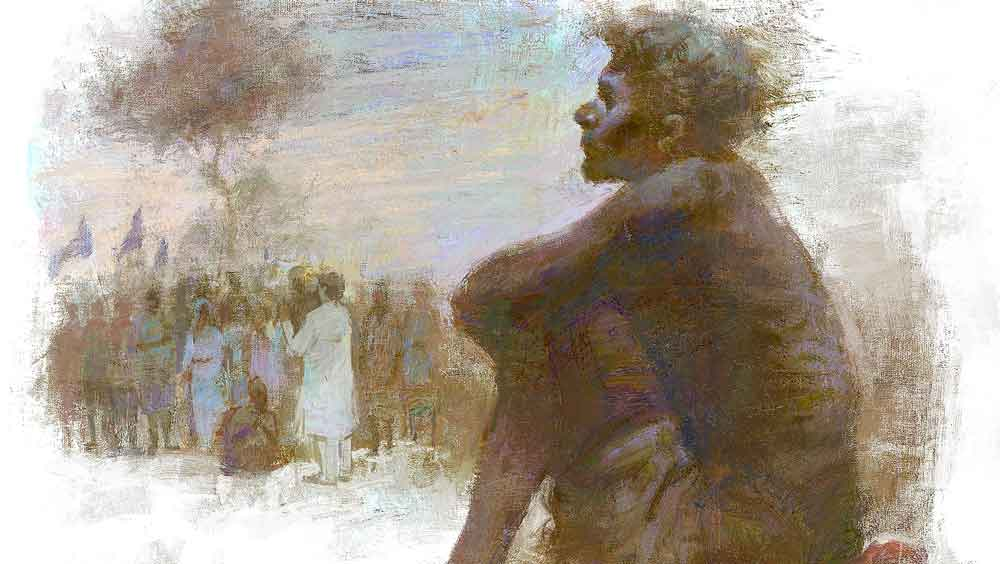

 
 <h1 align=center>হ্যামেলিনের বাঁশিওয়ালা</h1>
<h2 align=center>রঞ্জন চক্রবর্তী</h2> আমোদপুর গ্রামে রটে গেল, আগামী বুধবার দুপুরে একটা বড় মিছিল বেরোতে চলেছে। গ্রাম পঞ্চায়েতের স্থানীয় মেম্বার রাখহরি সাঁতরা হাটবারে এসে বলল, এটা আসলে প্রতিবাদ মিছিল। কথাটা শুনলেও প্রতিবাদ যে কিসের বিরুদ্ধে, সেটা কারও কাছে পরিষ্কার হল না। রাখহরিও এর চেয়ে বেশি কিছু বলতে পারল না। তখন গ্রামের লোকেরা ঠিক করল, পঞ্চায়েতের প্রধান সুবল মণ্ডলের কাছে যাওয়াই ভাল। সুবল মান্যগণ্য লোক। সে নিশ্চয়ই পুরো ব্যপারটা বুঝিয়ে বলতে পারবে।

সুবল থাকে মাইলতিনেক দূরে মধুপুরে। অতটা পথ হেঁটে যাওয়ার কথায় বেশির ভাগ লোকই সরে পড়ল। শেষে ঠিক হল, গ্রামের কয়েক জন মাতব্বর গোছের লোক সুবলের কাছে যাবে। সেই দলে গুরুপদও ছিল। তাকে নেওয়া হয়েছিল দল ভারী করার জন্য।

সুবল পোড়-খাওয়া লোক। তীক্ষ্ণ দৃষ্টিতে সকলের মুখগুলো এক বার জরিপ করে নিয়ে গম্ভীর ভাবে বলল, “সমস্যা তো একটা নয় হে। ঘরে ঘরে লেখাপড়া শিখে ছেলেমেয়েরা বেকার বসে আছে, একের পর এক কলকারখানা বন্ধ হয়ে যাচ্ছে, ফসলের ঠিকমতো দাম পাওয়া যাচ্ছে না, নিত্যপ্রয়োজনীয় জিনিসপত্রের দাম হু হু করে বাড়ছে। শুধু তা-ই নয়, প্রতিদিন চার দিকে হাজার রকম অন্যায় হয়ে চলেছে, আর গরিব খেটে খাওয়া মানুষ তার ফল ভোগ করছে। এ সবের বিরুদ্ধে প্রতিবাদের জন্যই এই মিছিল।”

এক জন প্রশ্ন করল, “এই মিছিল করে আমোদপুরের সমস্যাগুলোর সমাধান হবে তো? গত বছর বন্যায় গ্রামটা ভেসে গেছিল, খেতের ফসল সব নষ্ট হয়ে গেছিল। তার পর কর্তাদের কাছে বার বার দরবার করেও নদীর বাঁধ তৈরি হয়নি। এ বার বর্ষায় যে কী হবে ভাবতেই ভয় হয়!”

সুবল ধমকের সুরে বলল, “এই তো তোমাদের দোষ! সব সময় সঙ্কীর্ণ দৃষ্টিতে দেখতে চাও! শুধু আমোদপুরের কথা ভাবলেই চলবে না, বৃহত্তর প্রেক্ষাপটে গোটা বিষয়টা দেখতে হবে। এক দিকে আমেরিকায় আর্থিক মন্দা চলছে, অন্য দিকে আরব দেশগুলোর জন্য তেলের দাম ওঠা-নামা করছে।”

আমেরিকার অর্থনৈতিক মন্দা বা আরবে তেলের দাম বাড়া-কমার সঙ্গে আমোদপুরের সমস্যাগুলোর সম্পর্ক কোথায়, সেটা কেউই বুঝল না। তা ছাড়া আমেরিকা বা আরবের ভৌগোলিক অবস্থান বিষয়েও কারও ধারণা ছিল না। তবে আরও কিছু ক্ষণ কথাবার্তা চলার পর সকলে এটা বুঝতে পারল, আর ঘরে বসে থাকা উচিত নয়। মিছিলে শামিল হওয়াটা ভীষণ জরুরি।

আমোদপুর গ্রামের মাথারা একজোট হয়ে সিদ্ধান্ত নিল মিছিলে যাবে। নির্বাচিত হল গুরুপদ। তাতে গুরুপদর বিশেষ আপত্তি ছিল না। সুবলের মুখ থেকে সব বিস্তারিত শোনার পর মিছিলের গুরুত্ব উপলব্ধি করে সে বাড়তি উৎসাহ পেয়েছিল। কিন্তু আট মাসের গর্ভবতী বৌ যমুনাকে ঘরে রেখে সে যায় কী করে! গ্রামের মাথারা দায়িত্ব নিতে এগিয়ে এল। গুরুপদ যখন গোটা গ্রামের তরফ থেকেই যাচ্ছে, তখন একটা দিন তার পরিবারের দেখাশোনা করাটা তো কর্তব্যের মধ্যেই পড়ে।

গুরুপদ রাখহরিকে জিজ্ঞেস করল, “তা হলে মিছিলটা কোথা থেকে শুরু হবে?”

রাখহরি একটু বিব্রত হয়ে বলল, “তা ঠিক বলতে পারব না। তবে এটা জানি যে মিছিল শেষ অবধি পৌঁছবে জেলা সদরে।”

গুরুপদ আবার প্রশ্ন করল, “আচ্ছা, মিছিলে কত লোক হবে?”

রাখহরি আশ্বাসের সুরে বলল, “তুই তো মিছিলের সঙ্গে হাঁটবি। তখন নিজের চোখেই দেখতে পাবি। দেখিস, মাঝরাস্তায় ফিরে আসিস না যেন!”

মিছিলে হাঁটতে গুরুপদর কোনও অসুবিধে নেই। হাঁটার অভ্যেস তার যথেষ্টই আছে। এ গ্রাম থেকে ও গ্রামে তাকে হেঁটেই যাতায়াত করতে হয়। তবে মিছিলটা কোথা থেকে শুরু হচ্ছে সেটা খুঁজে নেওয়াই মূল সমস্যা। তা ছাড়া ক’বারই বা আর মিছিলের সঙ্গে জেলা সদরে গেছে সে! তার উপর লিখতে-পড়তে জানে না। যাই হোক, মিছিলে যোগ দেওয়ার পথে এ সব কোনও বাধা হয়ে দাঁড়াবে না। মনের জোরই হল আসল।

নির্দিষ্ট দিনে মিছিলে যোগ দেওয়ার জন্য দুপুর নাগাদ বাড়ি থেকে বেরোল গুরুপদ। গ্রামের লোকেরা একজোট হয়ে সিদ্ধান্ত নিয়ে তাকে মিছিলে পাঠিয়েছে, এ কথা ভেবে তার মন উত্তেজনায় ভরপুর! গ্রামের সীমানা পেরিয়ে এসে বাবুডাঙার মোড়ের কাছে মাটির রাস্তা শেষ হয়ে পাকা রাস্তার শুরু। গুরুপদ শুনেছে মিছিল নাকি সেখান দিয়েই যাবে।

বাবুডাঙার মোড়ে এসে গুরুপদ দেখল, সেখানে অনেক লোক জমা হয়েছে। সবাই মিছিল দেখতে চায়। সেই ভিড় ঠেলে সামনে এল গুরুপদ। বেশ কয়েক জন লোক স্লোগান দিতে দিতে হেঁটে আসছিল। সামনের লোকেদের হাতে একটা ফেস্টুন। সেখানে অনেক কথা লেখা থাকলেও গুরুপদ পড়তে পারল না।

লোকগুলো কাছাকাছি এলে তাদের দলে ভিড়ে গেল গুরুপদ। কিছু দূর হাঁটার পর চম্পাহাটির কাছাকাছি এলে এক জন মাতব্বর গোছের লোক তাকে ভারিক্কি চালে জিজ্ঞাসা করল, “তুমি কোথা থেকে আসছ?”

গুরুপদ বলল, “আমি আসছি আমোদপুর গ্রাম থেকে।”

লোকটা একটু ভেবে বলল, “আমরা কয়েক জন নেতার সঙ্গে দেখা করার জন্য তাড়াতাড়ি করে এগিয়ে যাচ্ছি। মূল মিছিলটা পিছনে আসছে। এখানে পৌঁছতে খানিকটা সময় লাগবে। তুমি বরং ক্যাম্পে বসে অপেক্ষা করো।”

রাস্তার ধারে একটা বটগাছের তলায় অনেকটা জায়গা কাপড় দিয়ে ঘিরে রাখা, উপরে ত্রিপলের ছাউনি। কয়েক জন ব্যাজ পরা লোক সেখানে দাঁড়িয়ে ছিল। গুরুপদ দল থেকে বেরিয়ে সে দিকে গেল। তাকে দেখেই এক জন জানতে চাইল, “তুমি মিছিলে যাবে তো?”

গুরুপদ মিনমিন করে বলল, “হ্যাঁ, সেই জন্যই তো বেরিয়েছি।”

লোকটা ভারিক্কি চালে বলল, “তা হলে এখন এই ক্যাম্পে বসে অপেক্ষা করো। মিছিল এখানে আসতে অনেক সময় লাগবে।”

ক্যাম্পে আরও অনেকে বসে ছিল। তাদের সঙ্গে কথা বলে গুরুপদ জানল, সকলেই আশেপাশের বিভিন্ন গ্রাম থেকে মিছিলে যোগ দিতে এসেছে। গুরুপদ এক জনকে শুধোল, “বলতে পারো সদর শহরের কোথায় যাবে মিছিল?”

লোকটি বলল, “সে কী, জানো না! মিছিল যাবে জেলাশাসকের দফতরের কাছে। তাঁর কাছে আমাদের সব দাবিদাওয়া জানানো হবে।”

গুরুপদ অবাক হয়ে বলল, “সে তো বড় ব্যাপার ভাই!”

লোকটি নড়েচড়ে বসে বলল, “সমস্যাও যে বড়, তাই বড় মিছিল করতে হবে, বড় শহরে যেতে হবে।”

কথাটা শুনে আশ্বস্ত হল গুরুপদ। তাদের পঞ্চায়েতের প্রধান সুবলও এ রকমই একটা কিছু বলেছিল বটে। এমন সময় দূর থেকে কানে এল উঁচু গলার স্লোগান। দেখা গেল অনেক লোক সুশৃঙ্খল ভাবে এগিয়ে আসছে। তাদের হাতে বড়-ছোট বিভিন্ন আকারের পতাকা, পোস্টার আর বড় বড় ফেস্টুন।

মিছিল ক্যাম্পের পাশ দিয়ে যাবার সময় টুক করে সেই দলে ভিড়ে গেল গুরুপদ। এক জন বয়স্ক লোক তার পাশেই হাঁটছিল। কিছু ক্ষণ হাঁটার পর তাকে প্রশ্ন করল, “জেলা শহর আরও কত দূরে?”

 লোকটির স্বরে ফুটে উঠল ক্লান্তি, “এখনও অনেক দূর যেতে হবে। মনে রেখো, আমরা কিন্তু বড় লড়াই লড়তে নেমেছি।”

গুরুপদ সম্মতিসূচক ঘাড় নেড়ে বলল, “তা তো ঠিকই। জেলা সদরে না পৌঁছলে চলবে না।”

লোকটি বিজ্ঞের মতো বলল, “আরে জেলা সদরে গেলেই তো লড়াই শেষ হবে না। তার জন্য রাজ্যের রাজধানীতে যেতে হবে।”

গুরুপদ অবাক হয়ে বলল, “তা এত লোক, সবাই পায়ে হেঁটে
সেখানে যাবে?”

লোকটি বিরক্তির সুরে বলল, “তা কেন! জেলা শহর থেকে বাসে চেপে রাজধানী যাওয়া হবে। তবে সকলে সেই সুযোগ পাবে না।
যারা আন্দোলনকে সামনে এগিয়ে নিয়ে যেতে পারবে, কেবল তারাই সেখানে যাবে।” 

মিছিল সার বেঁধে এগিয়ে চলেছিল। জেলা শহরে পৌঁছতে প্রায় সন্ধ্যা হয়ে গেল। আবছা আলোয় পতাকাগুলো দেখা গেলেও মিছিলের মুখগুলো স্পষ্ট দেখা যাচ্ছিল না। হঠাৎ মিছিলটা থেমে গেল। একটা গাড়ি মিছিলের সামনে এসে থামল। সেটা থেকে সাদা পাজামা-পাঞ্জাবি পরিহিত এক জন মানুষ নামলেন। তাঁর হাবভাব দেখে তিনি যে নেতা, তা আর বলে দিতে হল না। তিনি হাত তুলে সকলকে আশ্বস্ত করে বললেন, “আপনাদের সকলের হয়ে আমি কয়েক জন প্রতিনিধি নিয়ে জেলাশাসকের সঙ্গে দেখা করতে যাচ্ছি। তাঁর সঙ্গে কী কী আলোচনা হল, ফিরে এসে সব  আপনাদের জানাব।”

পড়িমরি করে ভিড় ঠেলে নেতার সামনে এসে দাঁড়াল গুরুপদ। হাত জোড় করে বলল, “আজ্ঞে, আমি সেই বেলা দুপুর থেকে হাঁটছি। আমাদের আমোদপুর গ্রামের সমস্যাগুলোর কথা একটু ভাল করে বুঝিয়ে বলবেন।”

নেতা হেসে বললেন, “বেশ তো, তোমাদের সমস্যাটা কী বলো।”

গুরুপদ মাথা চুলকে বলল, “আজ্ঞে সেটা ঠিক গুছিয়ে বলতে পারব না। তবে আপনি তো সবই জানেন।”

নেতা মোলায়েম গলায় বললেন, “ঠিক আছে, আমি যা বলার বলব। কিন্তু মনে রেখো ভাই, লড়াই এখানেই শেষ নয়। রাজধানী যেতে হবে, আরও অনেক পথ হাঁটতে হবে।”

গুরুপদ দৃঢ় কণ্ঠে বলল, “আমি মাঝপথে কিছুতেই লড়াই ছেড়ে পালিয়ে যাব না।”

নেতা পিঠ চাপড়ে দিয়ে বললেন, “বাঃ, তোমার তো খুব মনের জোর। এ রকম লোকই আমাদের চাই।”

নেতামশাই সদলবলে সামনে এগিয়ে গেলেন। একটা দোকানের সামনে বসল গুরুপদ। বেশ ঠান্ডা লাগছিল, কাঁধের ঝোলা থেকে একটা চাদর বার করে ভাল করে গায়ে জড়িয়ে নিল। নেতা ফিরে এসে কী বলেন, সে সব না শুনে তো ফিরে যাওয়া চলবে না।

বেশি ক্ষণ অবশ্য অপেক্ষা করতে হল না। আলোচনা শেষ করে ফিরে এসে নেতা সকলের উদ্দেশে ঘোষণা করলেন, “আপনাদের সমস্যার কথা আমি আধিকারিককে জানিয়েছি। কিন্তু এই সব সমস্যা সহজে মেটার নয়, এর শিকড় অনেক গভীরে। সুতরাং এখান থেকেই আসল লড়াই শুরু হল। ভবিষ্যতে কঠিন সংগ্রামের জন্য আমাদের প্রস্তুত থাকতে হবে। মনে রাখতে হবে সমস্যাটা শুধু এই রাজ্যের নয়, এ হল গোটা দেশের সমস্যা। তার জন্য আমাদের প্রথমে রাজ্যের রাজধানী যেতে হবে, তার পর দেশের রাজধানী যেতে হবে। যারা শেষ পর্যন্ত লড়াইতে টিকে থাকতে পারবে, তারা সেখানে যাবে।”

বক্তব্য থামতেই ফটাফট হাততালি পড়ল। ব্যস্তসমস্ত হয়ে গাড়িতে উঠে নেতা চলে গেলেন।

ফেরার পথে গুরুপদর সঙ্গে সেই বয়স্ক লোকটির আবার দেখা হয়ে গেল। সে গুরুপদকে জিজ্ঞাসা করল, “আমি পিছনে পড়ে গেছিলাম, ভাল করে শুনতে পাইনি। কী যেন বলে গেলেন নেতামশাই?”

গুরুপদ উত্তেজিত ভাবে জানাল, “নেতা বললেন কেবল রাজ্যের রাজধানী গেলেই হবে না, সমস্যা সমাধানের জন্য দেশের রাজধানী যেতে হবে।”

লোকটি আগ্রহের সঙ্গে জানতে চাইল, “কাদের সঙ্গে নিয়ে সেখানে যাবেন সেটা বলেছেন?”

গুরুপদ মাথা নেড়ে বলল, “না, তা অবিশ্যি বলেননি। তবে এটা বলেছেন যাদের শেষ পর্যন্ত লড়াই চালিয়ে যাওয়ার সাহস আছে কেবল তারাই যাবে।”

লোকটা আর কোনও কথা বলল না। তার পাশাপাশি চুপচাপ হেঁটে চলল গুরুপদ। এ ভাবেই পেরিয়ে গেল অনেকটা পথ। সে যখন আমোদপুর ফিরল তখন
অনেক রাত।

গুরুপদর জন্য অধীর আগ্রহে পথ চেয়ে বসে ছিল যমুনা। সে ঘরে ঢুকতেই থালায় রুটি-তরকারি এগিয়ে দিয়ে বলল, “আজ মিছিলে কী হল?”

খেতে বসে মিছিলের বিস্তারিত গল্প শোনাল গুরুপদ। শেষে বলল, “আজ শহরের এক জন বড় নেতা এসেছিলেন। তিনি বললেন দেশের রাজধানীতে যেতে হবে।”

এ বার যমুনা চমকাল, “তুমিও কি নেতার সঙ্গে সেখানে যাবে?”

রুটির টুকরো মুখে পুরে গুরুপদ বলল, “জায়গাটা অনেক দূর, ট্রেনে চেপে যেতে হয়। সবাইকে তো নিয়ে যাবেন না। যাদের শেষ পযন্ত
লড়াই করার হিম্মত আছে কেবল তারাই যাবে।”

যমুনা অবাক হয়ে জিজ্ঞাসা করল, “তোমরা দেশের রাজধানীতে গেলেই আমাদের গ্রামের সব সমস্যা মিটে যাবে তো?”

গুরুপদর চোয়াল কঠিন হল। দাঁতে দাঁত চেপে বলল, “তা ঠিক জানি না। তবে আমি এর শেষ দেখবই।”

বাইরে রাত আরও গভীর হয়। অন্ধকার জানে, গুরুপদরা তাদের শেষ নিঃশ্বাস পর্যন্ত লড়াই দেখে, সাধ্যমতো লড়েও। শুধু অনন্ত লড়াইয়ের শেষটা দেখতে পায় না।